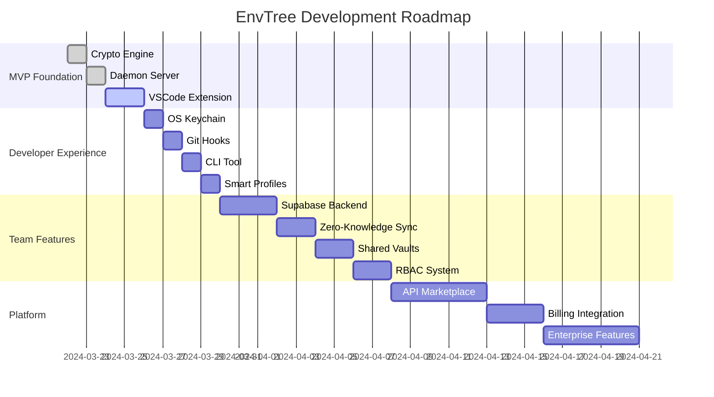

# EnvTree

Sick and tired of editing / updating numerous .env files?

Well, I am. 

So, this is going to be my personal solution. 

Meet, EnvTree.

## The Problem

Managing environment variables across multiple projects is a pain:
- Copy-pasting secrets between projects
- Forgetting which .env file has the latest values
- Risk of committing secrets to git
- Manual rotation of API keys
- No centralized audit trail

## The Solution

EnvTree is a developer-first secret management tool that integrates directly into your workflow:

### Core Principles
- **Simplicity** - Zero dependencies, minimal API, one-click actions
- **Convenience** - Auto-detectie, inline workflow, smart suggestions  
- **Local-First** - Offline capable, no vendor lock, optional sync

## Architecture Pipeline

```mermaid
graph TB
    subgraph "Developer Workflow"
        A[Developer writes code] --> B[VSCode Extension detects missing secret]
        B --> C[Click "Add to EnvTree"]
        C --> D[Secret encrypted & stored]
        D --> E[1-click inject to .env]
    end
    
    subgraph "System Architecture"
        F[VSCode Extension] <--> G[CLI Tool]
        G --> H[Local Vault Daemon]
        H --> I[Core Engine]
        I --> J[SQLite Storage]
        J --> K[Optional Supabase Sync]
    end
    
    subgraph "Security Layer"
        L[User Password] --> M[PBKDF2 + Salt]
        M --> N[Derived Key]
        N --> O[AES-256-GCM Encryption]
        O --> P[Encrypted Storage]
    end
    
    E --> F
    H --> I
    I --> L
    
    style A fill:#e1f5fe
    style F fill:#f3e5f5
    style H fill:#e8f5e8
    style L fill:#fff3e0
```

## User Experience Flow

```mermaid
flowchart LR
    subgraph "Phase 1: Setup"
        A1[Install Extension] --> A2[Init Project]
        A2 --> A3[Master Key Setup]
    end
    
    subgraph "Phase 2: Daily Usage"
        B1[Code Detection] --> B2[Add Secret]
        B2 --> B3[Inject to .env]
        B3 --> B4[Git Hook Check]
    end
    
    subgraph "Phase 3: Team Features"
        C1[Optional Sync] --> C2[Shared Vault]
        C2 --> C3[RBAC Control]
        C3 --> C4[Audit Trail]
    end
    
    A3 --> B1
    B4 --> C1
    
    style A1 fill:#4caf50,color:#fff
    style B1 fill:#2196f3,color:#fff
    style C1 fill:#ff9800,color:#fff
```



## Product Evolution



## Tech Stack

| Layer | Technology | Purpose |
|-------|------------|---------|
| **Frontend** | VSCode Extension API | Primary user interface |
| **Backend** | Node.js | Local vault daemon |
| **Storage** | SQLite | Encrypted local database |
| **Crypto** | Native Node Crypto | AES-256-GCM encryption |
| **Sync** | Supabase | Optional cloud sync |
| **CLI** | Node.js Executable | Terminal operations |

## Quick Start

```bash
# Install VSCode Extension
code --install-extension envtree.vscode-extension

# Initialize project
envtree init

# Add secret
envtree add DATABASE_URL="postgresql://..."

# Inject to .env
envtree inject

# Rotate secret
envtree rotate DATABASE_URL
```

## Project Structure

```
EnvTree/
├── apps/
│   ├── extension/        # VSCode extension
│   ├── daemon/           # Local vault server  
│   └── cli/              # Terminal tool
├── packages/
│   ├── crypto/           # Encryption logic
│   ├── storage/          # SQLite layer
│   └── core/             # Business logic
├── infra/
│   └── supabase/         # Cloud sync
└── scripts/
```

## Next Steps

1. **MVP Implementation** - Core crypto + daemon + extension
2. **Developer Experience** - OS keychain + git hooks + CLI
3. **Team Collaboration** - Shared vaults + RBAC + audit
4. **Platform Scaling** - API marketplace + billing

---

*Built with **Simplicity + Convenience + Local development** in mind.*
